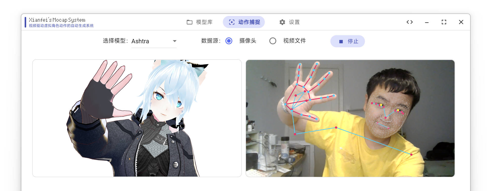
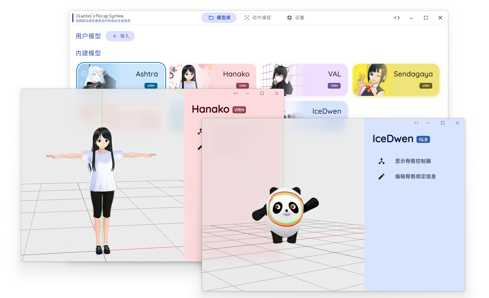

## SysMocap

A cross-platform real-time video-driven motion capture and 3D virtual character rendering system for VTuber/Live/AR/VR.

Available for Windows, macOS (packaged) & Linux (source code only)

 [Download Now](https://github.com/xianfei/SysMocap/releases)

(This is a multi-language software, including English. )

本科毕业设计作品。点击此处阅读中文说明。

### Highlights

🌟 Beautiful GUI with Material Design 3 Color System

🌟 Easy to used. You can import 3D models just with drags.

https://user-images.githubusercontent.com/8101613/167257555-8b8d4b99-f99f-4b79-8891-967b8723e3f8.mp4

🌟 Support WebXR API on Mocap Forwarding (HTTPS only)

https://user-images.githubusercontent.com/8101613/167257906-596919a5-4c0e-4795-865f-384a15c0d39f.mp4

### Bugs

1. Only support VRM file now.

2. On Windows platform, "Use Discrete Graphics on Dual GPU Laptop" and "Mocap Data Forward" can not use at same time.

### Notice

1. HTTP & HTTPS will use **same port** in Mocap Data Forward.

### Required Skeleton Node in glTF/glb/FBX Model File for Macap:

(If not same as above, you need rebind them manually.)

- Hips (Main Node, both Position and Rotation. Ratation only for other nodes)

- Neck

- Chest

- Spine

- RightUpperArm

- RightLowerArm

- LeftUpperArm

- LeftLowerArm

- LeftUpperLeg

- LeftLowerLeg

- RightUpperLeg

- RightLowerLeg

### Development progress

#### To-Do

- [x] Settings page and global settings utils

- [ ] Add play/pause button and progress bar when mocap from video 

- [x] Support bones binding for glTF/glb

- [x] Support rendering glTF/glb model

- [ ] Support binding when bones' name is non-uniformed

- [x] Model library add user's custom 3D model

- [x] Live plug-in / interface for Open Broadcast Software

- [ ] ~~Output video ( using such as libffmpeg )~~

- [ ] ~~Support per-frame rendering without drop frame~~

- [ ] ~~Support c-s architecture for online video mocap ( on cloud )~~

- [x] Support Material Designed 3 Color System (color picking)

- [x] Mocap data forwarding via network

- [x] Adapt for Linux and macOS 
