<h1 align="center">
SysMocap
</h1>

<p align="center">
<a href="https://github.com/xianfei/SysMocap/actions" target="_blank">

</a>
</p>

<p align="center">
English Version | <a href="./README.zh-cn.md">中文版本</a> 
</p>

A cross-platform real-time video-driven motion capture and 3D virtual character rendering system for VTuber/Live/AR/VR.

Available for Windows, macOS (packaged) & Linux (source code only)

[Download Now](https://github.com/xianfei/SysMocap/releases) (zipped, without installation)

(This is a multi-language software, including English. )

### Highlights

🌟 Beautiful GUI with Material Design 3 Color System


🌟 Easy to used. You can import 3D models just with drags.

https://user-images.githubusercontent.com/8101613/167257555-8b8d4b99-f99f-4b79-8891-967b8723e3f8.mp4

🌟 Support WebXR API on Mocap Forwarding (HTTPS only)

https://user-images.githubusercontent.com/8101613/167257906-596919a5-4c0e-4795-865f-384a15c0d39f.mp4

🌟 Model viewer with bones & dressing controller

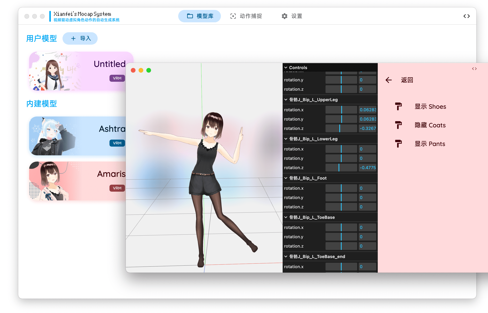

🌟 Support OBS live-streaming

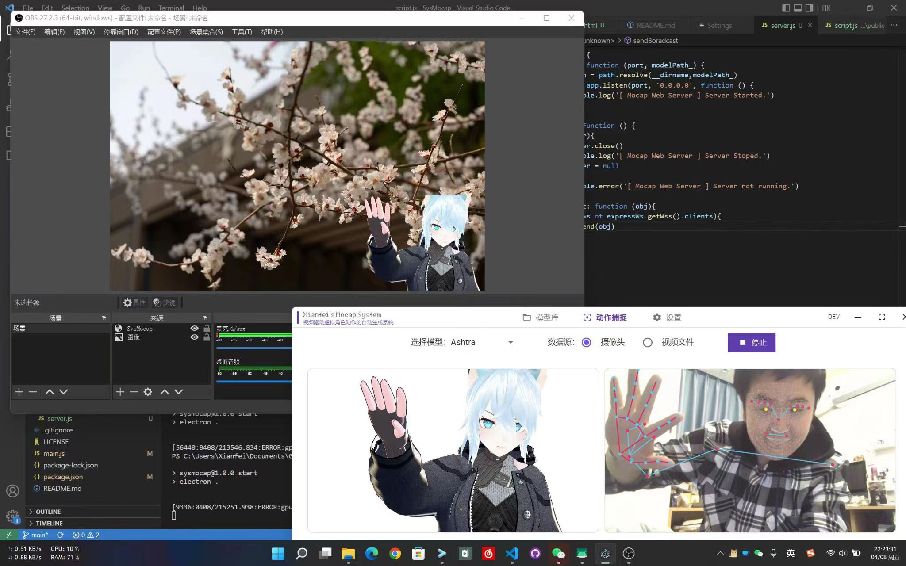

🌟 Support full-body motion capture


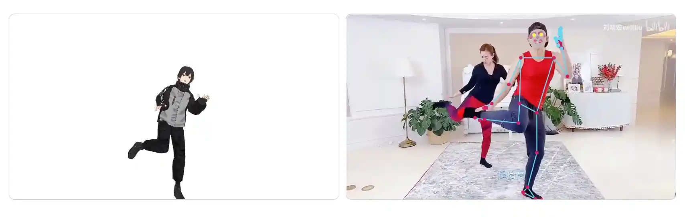

🌟 Support Auto Skeleton Detection for All VRM files and Mixamo Format FBX files

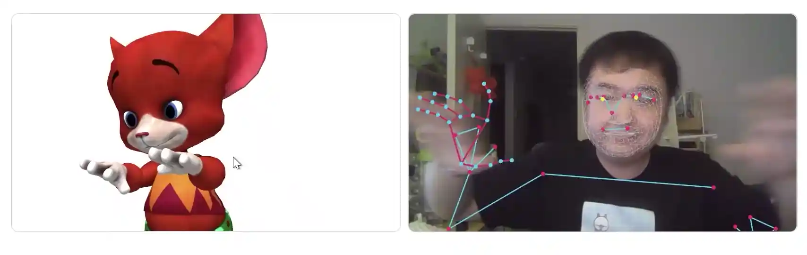

🌟 Support Any Skeleton Structure with Manual Mapping

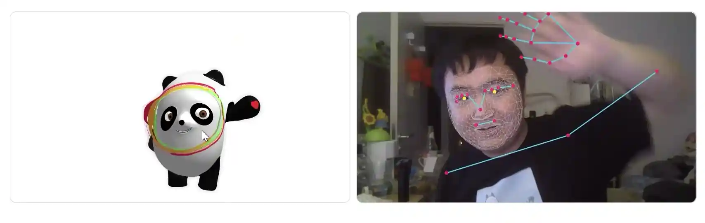

🌟 Does not require a discrete graphics card and runs smoothly even on eight-year-old computers (i7-4790k/GTX770/16G RAM)

🌟 Powered by Mediapipe and Kalidokit with Web Technologies

### More Effect Demonstration

🌟 Facial

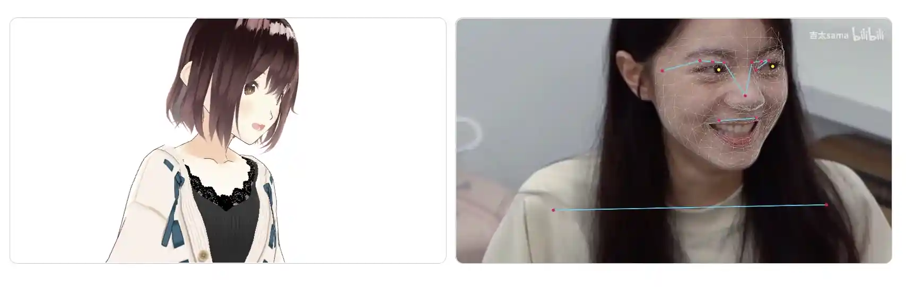

🌟 Half-body

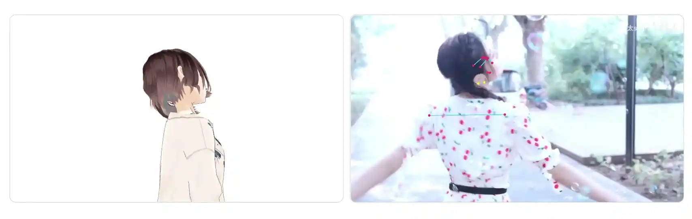

🌟 Half-body with Hands

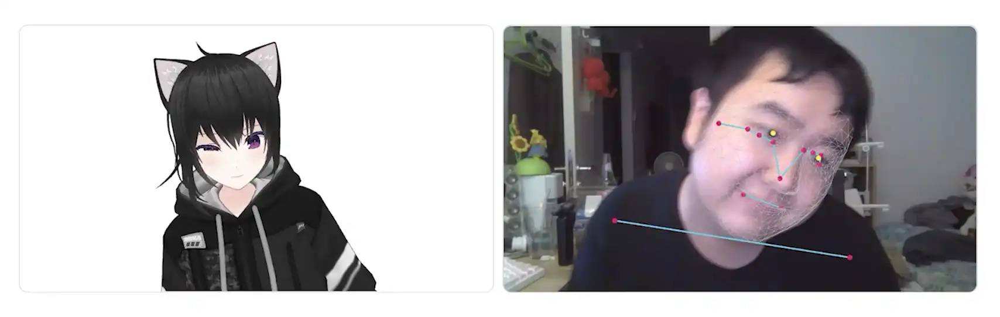

🌟 Full-body

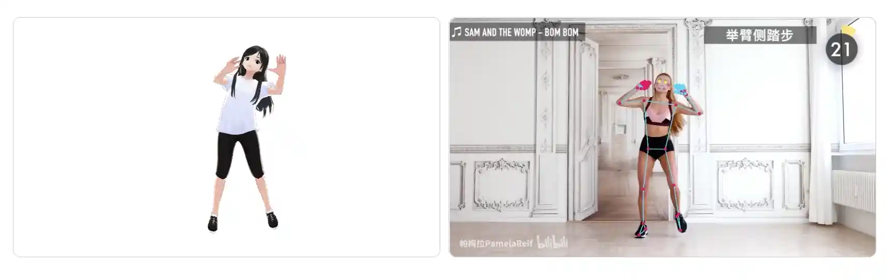

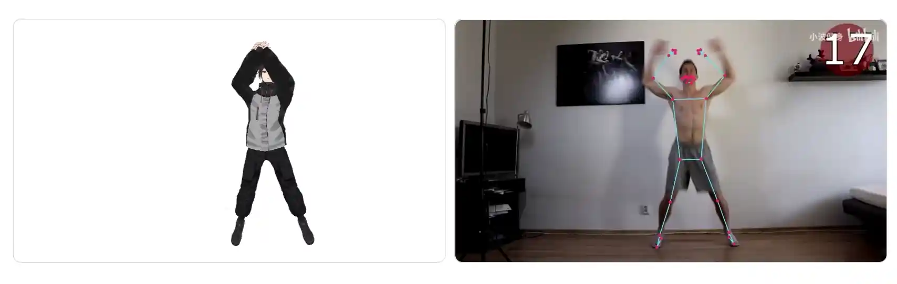

### System architecture

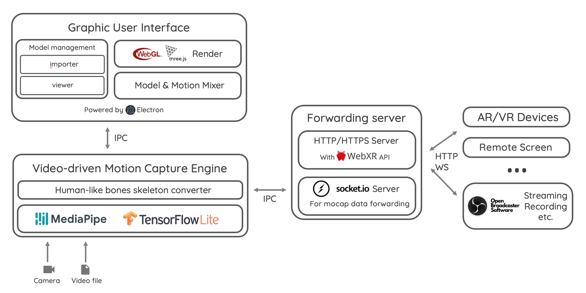

### How to use

Run on your computer from source code (need lastest Node.js):

```shell
git clone https://github.com/xianfei/SysMocap.git
cd SysMocap
npm i
npm start
```

### Bugs

1. ~~On Windows platform, "Use Discrete Graphics on Dual GPU Laptop" and "Mocap Data Forward" can not use at same time.~~

2. Camera controller only support VRM

3. Forwarding only support VRM

### Notice

1. HTTP & HTTPS will use **same port** in Mocap Data Forward.

### Required Skeleton Node in glTF/glb/FBX Model File for Macap:

(If not same as above, you need rebind them manually.)

- Hips (Main Node, both Position and Rotation. Ratation only for other nodes)

- Neck

- Chest

- Spine

- RightUpperArm

- RightLowerArm

- LeftUpperArm

- LeftLowerArm

- LeftUpperLeg

- LeftLowerLeg

- RightUpperLeg

- RightLowerLeg

### Development progress

#### To-Do

- [x] Settings page and global settings utils

- [x] Add play/pause button and progress bar when mocap from video 

- [x] Support bones binding for glTF/glb

- [x] Support rendering glTF/glb model

- [x] Support binding when bones' name is non-uniformed

- [x] Model library add user's custom 3D model

- [x] Live plug-in / interface for Open Broadcast Software

- [ ] ~~Output video ( using such as libffmpeg )~~

- [ ] ~~Support per-frame rendering without drop frame~~

- [ ] ~~Support c-s architecture for online video mocap ( on cloud )~~

- [x] Support Material Designed 3 Color System (color picking)

- [x] Mocap data forwarding via network

- [x] Adapt for Linux and macOS 
