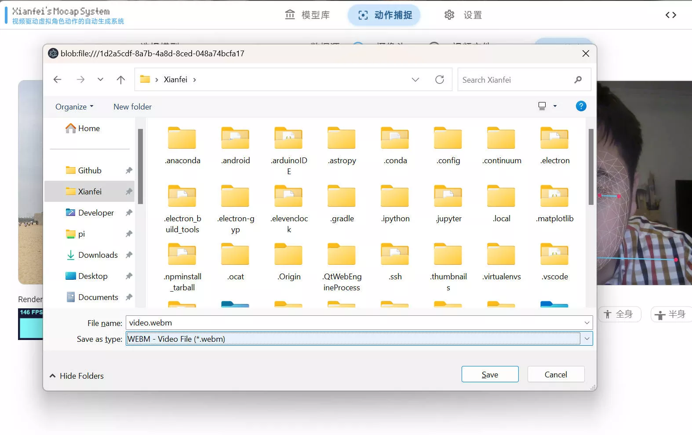
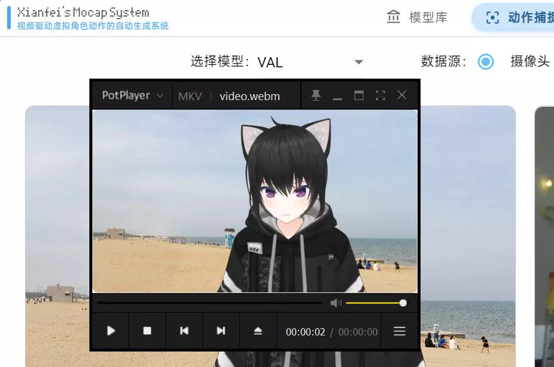
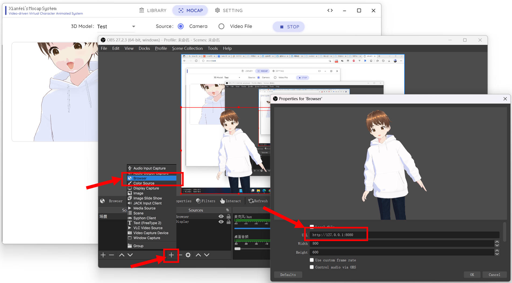

这是一个免费且开源的自由软件。https://github.com/xianfei/SysMocap

# 程序介绍

这是一个带有**视频驱动的实时动作捕捉系统**及**虚拟形象实时 3D 渲染程序**的软件，安装方便简单易上手，可用于虚拟主播、动画制作等用途。

# 导入模型

此系统支持导入 VRM、glb/glTF、FBX 模型文件。其中 VRM 模型文件规定其必须自带标准的人体骨骼架构，所以无特殊要求。glb/glTF、FBX 模型文件应包含骨骼信息。

导入封面图片是可选的，如果导入图片建议使用16:9比例。

### 从 VRoidHub 获取

网站（中国大陆可能需要特殊渠道访问）：https://hub.vroid.com/en

注册登录后，如果您喜欢的虚拟形象“Can you use this model?”为Yes，您即可下载该形象。下载到的VRM可在程序中“模型库”页面通过拖拽导入。

### 从 Mixamo 获取

网站：https://www.mixamo.com/#/?page=1&type=Character

注册登录后，在左上角“Character”中查找自己喜欢的虚拟角色，然后点击黄色“Download”按钮即可

### 使用 VRoidStudio 创建

(也可从stream下载该软件)  网站（中国大陆可能需要特殊渠道访问）：https://vroid.com/en/studio

可在搜索引擎中找到该软件的汉化版，导出VRM形象即可

# 渲染虚拟形象

### 更换背景

如需要更换背景，可直接将您想要更换的背景图片拖动至虚拟形象上，即可更换背景。

### 录制

该系统自带的录制功能较为简单，如需要更高要求的导出视频，建议使用OBS进行录制。

点击生成的虚拟形象后，按下R键即可进行录制。

再次按下R键即可结束录制，结束录制后会弹出文件保存对话框，询问您将要把视频保存在哪里。

然后您就可以播放您保存的视频了。

# 动作数据转发

如果需要在WebXR环境或浏览器、OBS环境使用动作数据转发，需要在设置打开此功能。

### 使用 OBS 进行直播

在 OBS 中添加来源并选择浏览器，输入 http://127.0.0.1:8080  （其中8080是您设置的端口号）即可。

导入后可以点击 交互 按钮 改变虚拟形象的位置。（通过WASD键及鼠标拖动、鼠标滚轮）

# 开源库

### 动作捕捉

视频驱动的动作捕捉技术采用 BlazePose & GHUM 算法。

卷积神经网络模型：[MediaPipe BlazePose GHUM 3D](../pdfs/pose_model_card.pdf)

开源库：

-   Google Mediapipe: https://google.github.io/mediapipe/

### 3D 模型渲染

开源库：

-   ThreeJS: JavaScript 3D Library https://threejs.org/

-   @pixiv/three-vrm: VRM 解析库 https://github.com/pixiv/three-vrm

### UI 技术架构

GUI 基于 fxDrawer 技术构建，使用 Web 前端技术。

开源库：

-   fxDrawer: 简单易用的跨平台绘图器/交互式图形库 https://github.com/xianfei/fxdrawer

-   Electron with Node.js: https://www.electronjs.org/

-   MDUI: Material Design 样式的前端框架 https://www.mdui.org/

-   Vue: 渐进式 JavaScript 框架 https://cn.vuejs.org/

Copyright © 2021-2023 Xianfei. All rights reserved.
